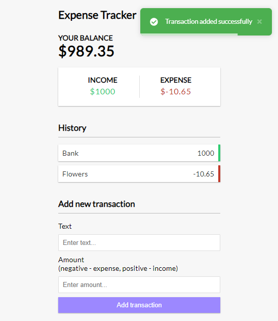

# Vue 3 Expense Tracker

An expense tracker app built with Vue 3 and the composition API. This application allows you to:

* Add and remove expenses and income entries
* Track your overall balance
* Save your data to local storage
* Receive notifications using Vue Toastification
* Utilize the `<script setup>` syntax (Vue 3.2+)

## Project Setup

```sh
npm install
```

### Compile and Hot-Reload for Development

```sh
npm run dev
```

### Compile and Minify for Production

```sh
npm run build
```
